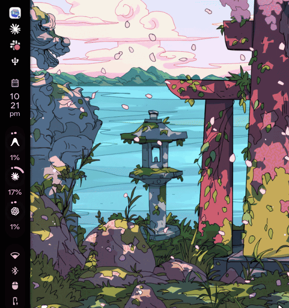

# codexbar-caelestia

CodexBar usage directly in the [Caelestia Shell](https://github.com/caelestia-dots/shell) bar.

See your Codex, Claude, Gemini, and Antigravity usage without opening another app. Each enabled provider gets its own progress ring. Hover over it to see usage windows, reset times, pace, and credits when available.

Usage data comes from the [CodexBar](https://github.com/steipete/CodexBar) Linux CLI.

<p align="center">
  
</p>

## Features

* Codex, Claude, Gemini, and Antigravity support
* One progress ring per provider
* Detailed usage popout on hover
* Reset countdowns for each usage window
* Pace and credit information when reported by CodexBar
* Native Caelestia components and Material You colors
* Automatic theme updates when your Caelestia color scheme changes
* Shared polling between all rings and popouts
* Cached provider data when a refresh temporarily fails
* Live configuration reload
* Install checks for Caelestia upgrades

## Requirements

You need:

* [Caelestia Shell](https://github.com/caelestia-dots/shell) 2.4.0 or newer
* `quickshell` 0.3 or newer
* The [CodexBar](https://github.com/steipete/CodexBar/releases/latest) Linux CLI
* `jq`
* `python3`

A C compiler is required only for Antigravity support.

### Caelestia installation

This project currently expects Caelestia to be installed as a system package, with the shell under:

```text
/etc/xdg/quickshell/caelestia
```

and your user overlay under:

```text
~/.config/quickshell/caelestia
```

This is the layout used by packages such as the AUR `caelestia-shell` package.

Manual Caelestia clones and Nix installations where the shell itself lives under `~/.config/quickshell/caelestia` are not currently supported by the installer.

## Install

First, install and configure the CodexBar CLI.

Make sure the providers you want to use are already authenticated through their respective CLIs. For example:

```bash
codex login
claude /login
agy login
```

Then install the Caelestia integration:

```bash
git clone https://github.com/Marouan-chak/codexbar-caelestia.git
cd codexbar-caelestia
./install.sh --enable-entry
```

Restart Caelestia:

```bash
caelestia shell -k
caelestia shell -d
```

You can check the shell logs with:

```bash
caelestia shell -l | grep -iE 'error|warn'
```

If everything is working, your enabled CodexBar providers should now appear next to the other Caelestia bar entries.

## Configuration

Configuration lives at:

```text
~/.config/codexbar-caelestia/config.json
```

Changes are picked up automatically.

Example:

```json
{
  "codexbarBin": "/home/you/.local/bin/codexbar",
  "refreshSeconds": 300,
  "ringSize": 0,
  "showLabels": true,
  "useProviderLogos": true,
  "hideUnavailable": true,
  "hiddenProviders": []
}
```

### Options

`codexbarBin`

Path to the CodexBar CLI. The installer detects this automatically.

`refreshSeconds`

How often usage information is refreshed. Default: `300`.

`ringSize`

Ring diameter in pixels. `0` uses the available width inside the Caelestia bar.

`showLabels`

Show the usage percentage below each provider ring.

`useProviderLogos`

Use provider logos inside the rings. When disabled, a Material icon is used instead.

`hideUnavailable`

Hide providers that have no usable data. Disable this if you want provider errors to remain visible in the bar.

`hiddenProviders`

Provider IDs that should not appear in the bar.

For example:

```json
{
  "hiddenProviders": ["antigravity"]
}
```

Provider enablement itself is controlled by:

```text
~/.codexbar/config.json
```

That file belongs to CodexBar. The configuration in this project only controls how those providers are displayed.

## Usage colors

Progress colors follow Caelestia's Material You palette.

* Below 70 percent uses `m3primary`
* From 70 to 89 percent uses `m3tertiary`
* 90 percent or above uses `m3error`
* Provider errors use `m3outline`

When cached data is being displayed, the ring uses Caelestia's wavy progress style and the popout shows `cached`.

## How it works

The data path is intentionally small:

```text
codexbar CLI → codexbar-usage.sh → CodexUsageService.qml → bar rings and popout
```

`scripts/codexbar-usage.sh` queries the enabled CodexBar providers and converts their responses into a small JSON format for QML.

`CodexUsageService.qml` polls that script and shares the result with every ring and the popout.

Provider requests are staggered rather than executed together because some services can trigger rate limits when queried in parallel.

Successful results are also cached. If one provider fails during a later refresh, its previous result can remain visible instead of disappearing from the bar.

## Antigravity on Linux

Antigravity needs a little extra handling because CodexBar was originally built around its macOS authentication flow.

### Credentials

On Linux, `agy login` stores credentials at:

```text
~/.gemini/oauth_creds.json
```

CodexBar normally expects Antigravity credentials elsewhere. The backend script handles this translation automatically.

You can override the credential path with:

```bash
CODEXBAR_ANTIGRAVITY_CREDS=/path/to/oauth_creds.json
```

### TLS

Antigravity communicates with its local language server using a self signed TLS certificate.

The installer builds a small local shim from:

```text
scripts/cert_redirect.c
```

and stores it under:

```text
~/.cache/codexbar-caelestia/cert_redirect.so
```

This allows CodexBar to trust the local Antigravity certificate without modifying your system certificate store.

If the shim cannot be built, only Antigravity is affected. The other providers continue working normally.

## What gets installed

The project adds four QML components to your Caelestia overlay:

```text
modules/bar/components/CodexUsage.qml
modules/bar/components/CodexUsageRing.qml
modules/bar/components/CodexUsageService.qml
modules/bar/popouts/CodexUsagePopout.qml
```

It also creates patched overlay copies of:

```text
modules/bar/Bar.qml
modules/bar/popouts/Content.qml
```

The original files under:

```text
/etc/xdg/quickshell/caelestia
```

are never modified.

The QML components are linked back to this repository, so pulling a new version updates them directly.

## Caelestia upgrades

Because two Caelestia files need small integration patches, it is worth checking the installation after upgrading Caelestia or Quickshell.

Run:

```bash
./install.sh --check
```

The check detects changes to the upstream files, missing patches, missing package files, and stale overlay files.

If it reports a problem, run:

```bash
./install.sh --enable-entry
```

again.

The installer rebuilds the overlay from the current Caelestia package files.

## Manual bar placement

Using:

```bash
./install.sh --enable-entry
```

is the easiest option.

If you prefer to manage `bar.entries` yourself, add:

```json
{
  "id": "codexUsage",
  "enabled": true
}
```

to your Caelestia bar configuration.

Keep in mind that setting `bar.entries` replaces Caelestia's default list rather than extending it.

You can inspect the current default order with:

```bash
qs -p scripts/probe-entries.qml
```

## Troubleshooting

### The widget does not appear

Check that `codexUsage` exists in your `bar.entries` configuration.

If you installed without:

```bash
--enable-entry
```

rerun:

```bash
./install.sh --enable-entry
```

### A provider is missing

Unavailable providers are hidden by default.

Set:

```json
{
  "hideUnavailable": false
}
```

and inspect the backend response:

```bash
~/.local/share/codexbar-caelestia/codexbar-usage.sh | jq '.providers[] | {id, error}'
```

### Rings show no usage

Run the backend directly:

```bash
~/.local/share/codexbar-caelestia/codexbar-usage.sh | jq
```

Provider errors returned by CodexBar are included in the JSON response.

### Antigravity does not work

Make sure:

* `agy login` has been completed
* The Antigravity language server is running
* A C compiler was available when `install.sh` ran

Running the installer again will retry building the TLS shim.

### Provider logos are missing

Run:

```bash
./install.sh
```

again, or disable provider logos in the configuration:

```json
{
  "useProviderLogos": false
}
```

### Configuration changes are ignored

Check the Caelestia logs:

```bash
caelestia shell -l | grep -i codexbar
```

An invalid JSON configuration falls back to the defaults.

## Uninstall

Run:

```bash
./install.sh --uninstall
```

This removes the installed QML integration and restores the affected overlay files.

The `codexUsage` entry in your Caelestia configuration is left untouched.

## Related projects

* [CodexBar](https://github.com/steipete/CodexBar), the CLI used for provider usage data
* [codexbar-waybar](https://github.com/Marouan-chak/codexbar-waybar), the same idea for Waybar
* [Caelestia Shell](https://github.com/caelestia-dots/shell), the shell this project integrates with

## Contributing

Issues and pull requests are welcome. See [CONTRIBUTING.md](CONTRIBUTING.md).

Problems with provider usage or the `codexbar` CLI itself should be reported to [steipete/CodexBar](https://github.com/steipete/CodexBar).

## Status

Currently tested on Arch Linux with Hyprland and Caelestia Shell 2.4.0.

Reports from other distributions and Caelestia setups are welcome.

## License

MIT. See [LICENSE](LICENSE).
